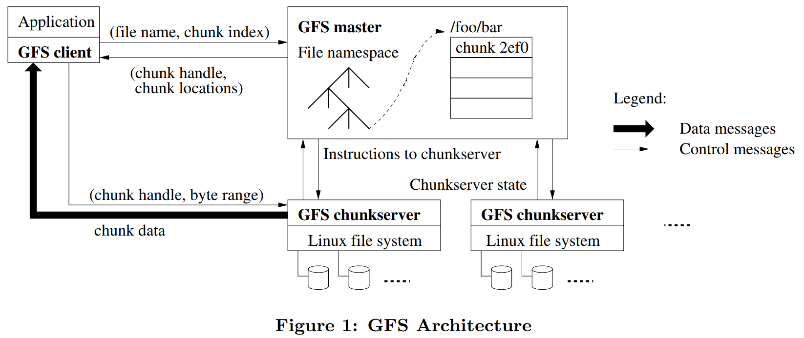
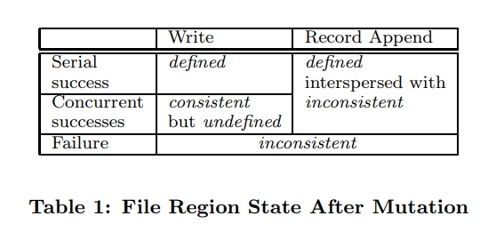

# notes for GFS

 

## 1. 使用场景

- system 由不可靠的商品化部件构成
- 该 system 主要存储适当数量的大文件，系统主要要针对 Multi-GB files 做优化
- workload 主要为 large streaming reads 和 small random read
- workload 中的 write 主要为 appending data，且写完后很少改动
- 要用尽可能少的 synchronization 实现 atomicity 以此实现多 client 的 concurrent 操作
- high sustained bandwidth > low latency

## 2. Interfaces

- **usual operation:** create, delete, open, close, read, write
- **special operation**
  - **snapshot:** create a copy of a file or a directory tree at low cost
  - **record append:** 在保证原子性的前提下支持多个 client 并行地向同一个文件 append 内容

### 2.1. Snapshot

> paper 3.4

**feature:**

- makes a copy of a file or a directory tree almost instantaneously  
- minimizing any interruptions of ongoing mutations  

**usage:**

- quickly create branch copies of huge data sets
- checkpointing  (before experimenting with changes that can later be committed or rolled back easily )

**implement:**

> copy-on-write

- master 收到 snapshot 指令
- 

### 2.2. Record append

> paper 3.3

traditional write: client 指定 data 写入的 offset

> 这会导致 concurrent write 出现问题

record append: 

- client 只指定 data
- GFS 至少尝试把 data apend 到文件中至少一次，由 GFS 指定并返回 offset

实现：

- client pushes the data to all replicas of the last chunk of the file

- sends request to the primary  

- primary 检查 append 会不会导致 chunk 超过限制 （64MB）
  - 若会超出，则不会对当前的 chunk 进行修改，同时通知 secondaries 也不要修改，让 client 对下一个 chunk 尝试 
  
    - 即允许内碎片的产生，因此要求一次 append 的大小小于 1/4 来保证内碎片不会太多太大
  
    >   问题：谁来申请新的 chunk 
    >
    >  目前猜测：client 向 master 发出申请
    >
    >   理由：文中说让 client 尝试下一个 chunk 说明新开一个 chunk 对 client 不是透明的，所以大概率不是 chunkserver 发申请？ 
  
  - 若不会超出，primary 写入 data，同时通知 secondaries 向 primary 指定的 offset 写入，写完后 secondaries 通知 primary，primary 通知 client append 成功
  
    - 如果 record append 在一个 replica 上失败了，那么 client 会重试
  
    - 这会导致同一个 chunk 的不同 replicas 可能存在不全同的情况（有的没写入，但是 primary 切换了？）
  
      > 不全同处是 inconsistent 的（因此也是 undefined），由 GFS 对于 inconsistent 的处理来解决 （paper 2.7.2）
  
    - GFS 保证 append success 时候一定在特定 chunk 的所有 replicas 的相同 offset 处有这份 data
  
    

## 3. Architecture

- single master
- multiple chunk-servers
- multiple clients

### 3.1. chunk related

> - files are divided into fixed-size chunks

#### 3.1.1. chunk usage

- **storage:** chunk-servers store chunks on local disks
- **read & write:** chunk-servers conduct the operation specified by a ***chunk handle and byte range***

#### 3.1.2. chunk handle

> the identifier of a chunk

- **property:** 64bit, immutable（不可改变的）, global unique

- **assignment:** assigned by the master at the time of chunk creation

#### 3.1.3. chunk size

> choose 64 MB

**advantage：**

- 减少 client 与 master 和 chunk-server 的 interaction （对于同一个 chunk 的读写只需要一次交互）
- chunk size 较大使得 client 可以轻松缓存下 TB 级文件的所有 chunk location information
- 由于 client 的操作会更有可能发生在同一个 chunk 上，可以通过保持一个 TCP 连接一段时间来减少网络开销
- 较大的 chunk size 使得所有 chunk 的 meta data 总量不会特别多，可以放在 master 的 memory 里

**fallback：**

- 对于 chunk 数较小（e.g. 1）的小文件，如果多个 client 访问该文件，那么持有该 chunk 的 chunk-server 就会成为 hot spots

**tricks：**

- 用 lazy space allocation 来避免 internal fragmentation

### 3.2. GFS master

#### 3.2.1. metadata

| data type                          | storage                                                      | recovery method                                              |
| ---------------------------------- | ------------------------------------------------------------ | ------------------------------------------------------------ |
| file and chunk namespaces          | master's memory & replicated log on the local disk of master and remote machines | 从 log 恢复                                                  |
| map from files to chunks           | 同上                                                         | 从 log 恢复                                                  |
| locations of each chunk's replicas | master's memory                                              | master setup 的时候向 chunk-server 询问得到；之后用 hearbeat messages 维护 |

> 为什么 location 要这么维护？
>
> 1. 避免了 chunk-server 在加入、退出、改名、fail、restart等情况时产生的 master 与 chunk-server 的同步问题（在一个有几百个 servers 的 cluster 中这个问题会过于频繁地出现）
> 2. 

#### 3.2.2. metadata: In-Memory Data Structures

**benefit:**

- master operation 很快

- master 可以 periodically scan，这可用于

  - chunk garbage collection

  - re-replication when **chunkserver failure** and **chunk migration**

    > to balance load and disk space usage across chunkserver

##### 3.2.2.1. chunk garbage collection

##### 3.2.2.2. re-replication

**limitation:** the memory size of the master (not a serious limitation)

- the chunk handler is 64 bytes for chunk of 64 MB
-  most chunks are full (一般而言一个文件有多个 chunk，只有最后一个是半满的)
- the file namespace require less than 64 bytes per file (store the name using prefix compression)

#### 3.2.3. metadata: operation Log

> a historical record of critical metadata changes

**The role of log:**

- the only persistent record of metadata
- a logical time line that define the order of concurrent operations

**So we have to:**

- store the log reliably
- not making changes visible to clients until metadata changes are made persistent

**How to achieve:**

- replicate on multiple remote machines
- respond to a client operation only after flushing the corresponding log record to disk both locally and remotely（在本地 log 和远端的 log 备份都持久化之后再应答）

**Improvements:**

- batch several log together before flushing

  > reduce impact of flushing and replication on the whole system throughput

**Usage:**

- master replay the log to recover its file system state (so the log should be small)

- 当 log 大小超过一定值，构建 checkpoint，保存在 disk 中，recover 的时候先找最近的 checkpoint

  - checkpoint 以类似 B树的形式打包

  构建 checkpoint 需要时间，如何在不打扰新的指令的情况下实现：

  - master 切换到一个新的 log file 继续跑
  - 新开一个 thread 从上个 checkpoint 开始 replay log（切换前的 log file 中的 log）
  - replay 完成后写到 local 和 remote 的 disk 里

  如何处理 checkpointing 的时候发生错误：

  - recovery code 检测并跳过不完整的 checkpoint

    > 理论上只需要保留最新的 checkpoint 和 log 文件即可，但一般为了容错会多保留一些

### 3.3. consistency model

#### 3.3.1. guarantees by GFS

- file namespace mutation:

  - atomic (by namespace lock)
  - sequence (by master's operation log)

- data mutation:

  **concept:**

  - consistent（一致性）：不论 client 从哪个 replica 上读取数据，读到的都一样

    > **usage:** a file region is consistent

  - defined：consistent 且 client 可以看到 mutation write 的整体

    > **usage:** A region is defined after a file data mutation

  

  > **concurrent success write：**consistent， undefined
  >
  > - all clients see the same data, but it may not reflect what any one mutation has written  
  > - may consists of mingled（交融的） fragments from multiple mutations（突变）
  >
  > **failed mutation：**inconsistent，undefined
  >
  > - different clients may see different data at different times  
  >
  > **record append：**行为是 defined，但是 data 的散布产生 inconsistent（是这个意思吗？）

  GFS 保证 sequence of success mutation 后 chunk 是 defined 且有最后写入的 data：

  - 对所有 replica 应用同样顺序的 mutation
  - 用 chunk version number 去判断一个 chunk 有没有过时（stale）（见 metadata），过时的 replicas 将不会参与之后的 mutation也不会在 client 向 master 询问的时候被给出（即这些 chunk 成为 garbage）（见 garbage collection）
    - 由于 client 会 cache chunk location，所以有可能会读到 stale chunk（窗口期由 cache 的有效时长和再次打开文件决定）
